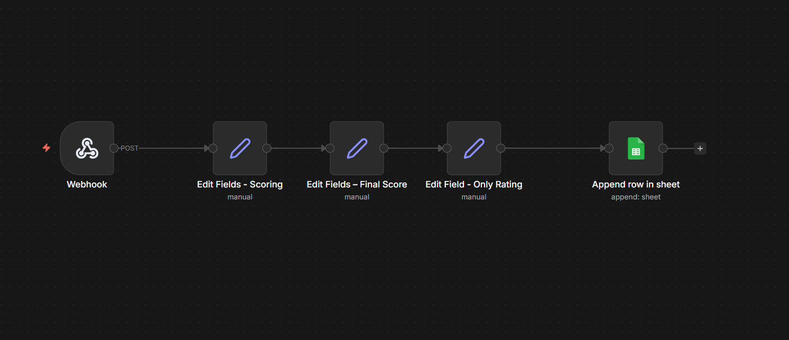

# AI Lead Scoring & Routing Automation (n8n)

## Problem
Incoming inquiries from forms and campaigns were manually reviewed, causing slow responses and missed high-intent prospects.

## Solution
A webhook-based automation that evaluates each inquiry, assigns a score, and categorizes it into a clear rating for fast action.

## Workflow
- Webhook receives inquiry data
- Custom scoring logic evaluates key fields
- Final score is normalized into a rating
- Data is stored for reporting and follow-up

## Tools Used
- n8n
- Webhooks
- Google Sheets

## Business Impact
- Faster response to high-intent inquiries
- Zero manual sorting
- Consistent, repeatable evaluation logic
